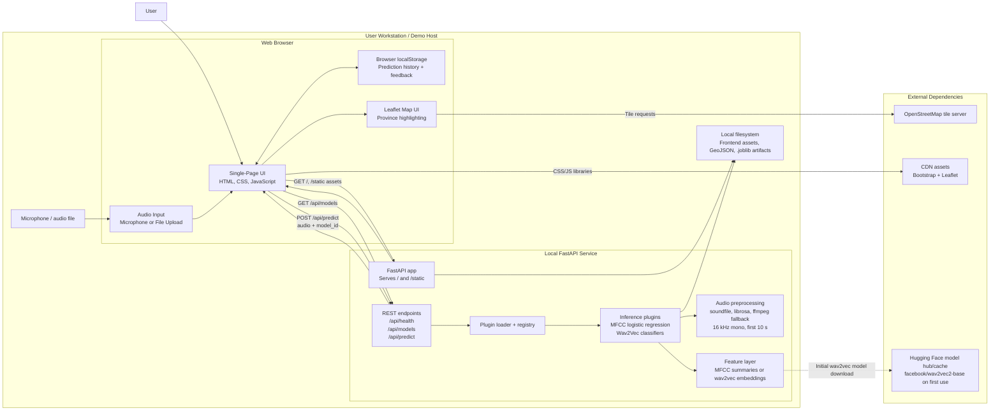

# Physical Architecture Diagram

This diagram describes the deployed `Prototype4` runtime as a physical system.
It focuses on where components live and how they communicate, rather than on
the detailed software call flow.

## Notes

- The browser and FastAPI backend both run on the same workstation during the
  current prototype/demo setup.
- The frontend is served directly by FastAPI, so there is no separate frontend
  build server in the deployed prototype.
- Prediction history and user feedback are stored in browser `localStorage`,
  not in a backend database.
- Model binaries and map data are loaded from the local filesystem under
  `Prototype4/backend/artifacts` and `Prototype4/frontend/data`.
- Wav2Vec-based plugins can require internet access the first time the shared
  encoder is loaded, after which it is cached locally by the Python runtime.

## Suggested Figure Caption

Physical architecture of the deployed Prototype4 accent-classification
prototype. A browser-based client captures or uploads audio, communicates with a
local FastAPI backend for model selection and inference, stores result history
in browser localStorage, and depends on locally stored model artifacts plus a
small number of third-party services for map tiles, CDN frontend libraries, and
the initial wav2vec model download.
